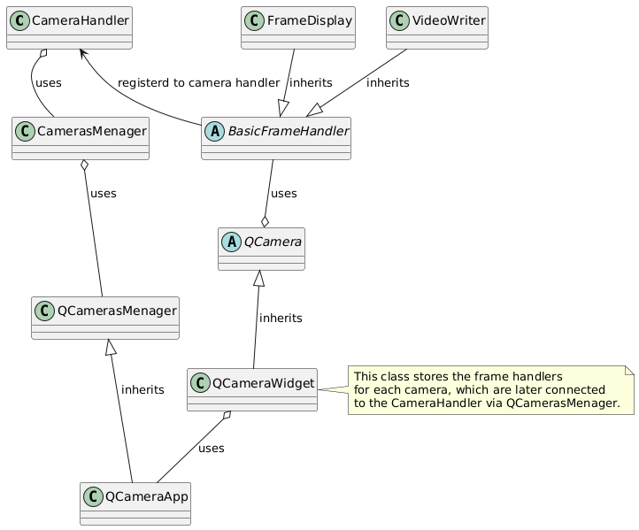

# MACKI_app

M.A.C.K.I., or Microgravity Actuated Capturing Kinetic Instrument, is a project that uses specially designed silicon grippers - 'tentacles' - in order to grasp objects. The main purpose of the experiment is to check whether the AEG will work in the reduced gravity environment and if it is viable for space-related projects.

## Setup

### Using Virtual Environment

1. **Clone the repository:**
    ```sh
    git clone https://github.com/yourusername/MACKI_app.git
    cd MACKI_app
    ```

2. **Create a virtual environment:**
    ```sh
    python -m venv venv
    ```

3. **Activate the virtual environment:**
    - On Windows:
        ```sh
        .\venv\Scripts\activate
        ```
    - On macOS/Linux:
        ```sh
        source venv/bin/activate
        ```

4. **Install the dependencies:**
    ```sh
    pip install -e .
    ```

5. **Run the application:**
    ```sh
    python main.py
    ```

### Using Poetry

1. **Clone the repository:**
    ```sh
    git clone https://github.com/yourusername/MACKI_app.git
    cd MACKI_app
    ```

2. **Install Poetry (if not already installed):**
    ```sh
    pip install poetry
    ```

3. **Install the dependencies:**
    ```sh
    poetry install
    ```

4. **Activate the virtual environment:**
    ```sh
    poetry shell
    ```

5. **Run the application:**
    ```sh
    python main.py
    ```

## Documentation
Class diagram of the cameras implementation

